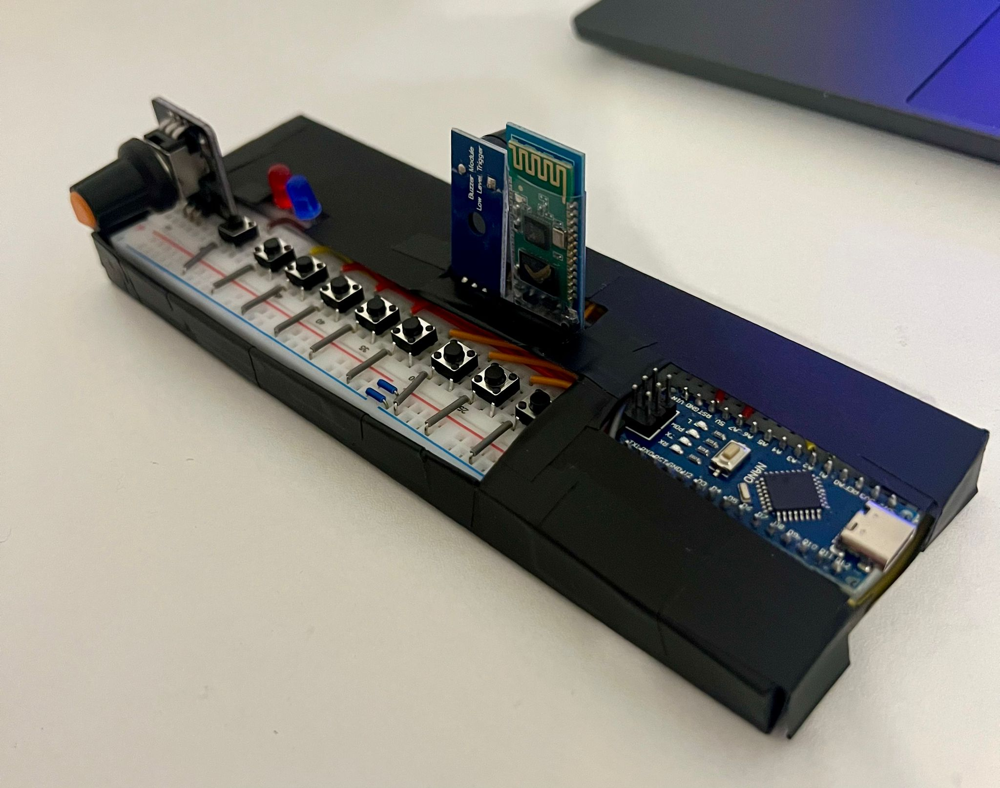
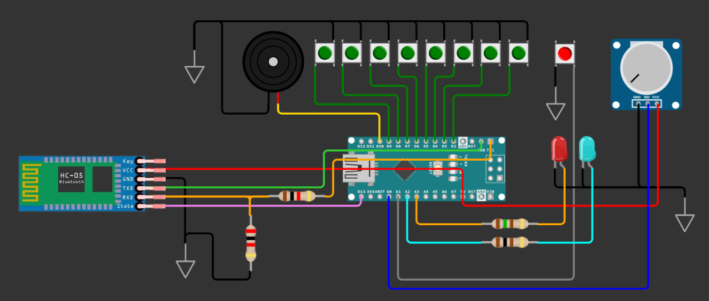
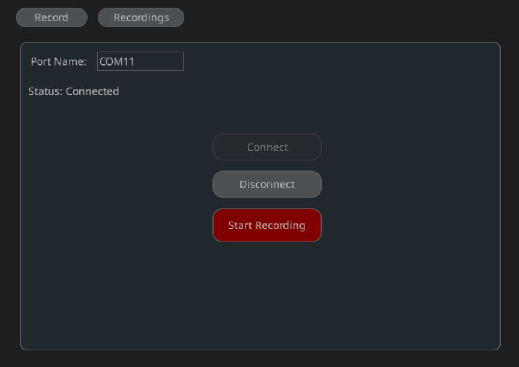
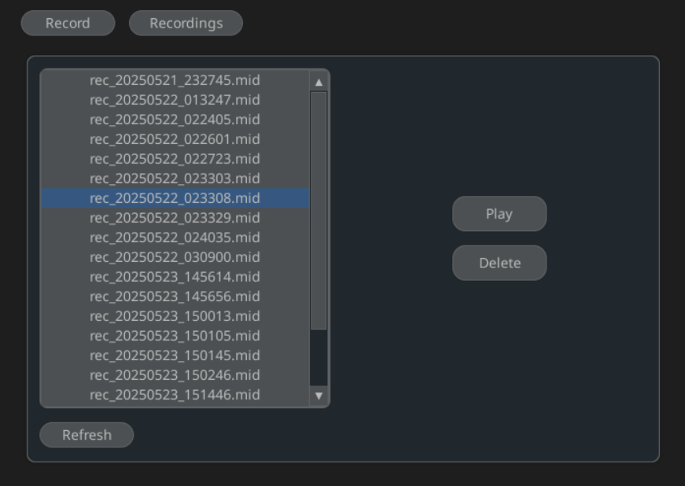

# MiniSynth - AVR-Based Hardware Synthesizer

## Overview

Portable hardware synthesizer capable of playing simple melodies and recording them as MIDI files through a Bluetooth connected companion desktop application

The device is built on an ATmega328P (Arduino Nano) using direct AVR register manipulation and integrates real-time audio generation and Bluetooth communication with a cross-platform Python app.

### Project features

* Plays musical notes in real time (passive buzzer, Timer1 Fast PWM)
* Adjustable pitch control (potentiometer, ADC)
* Wireless communication with desktop app (HC-05, Bluetooth)
* Records melodies to standard MIDI files
* Custom serial protocol for note events transmission
* Visual state feedback (LED indicators)
* End-to-end system integration (embedded firmware + desktop software)

[Full detailed documentation](https://ocw.cs.pub.ro/courses/pm/prj2025/ccristi/agavrilut) (implementation details, diagrams, edge cases, design decisions)

## Final device

[Demo video](https://youtu.be/qJW-3LLUZFE)

## Functionality

### Normal mode

* Real-time note playback with button inputs
* Adjustable pitch shift using potentiometer (C4-C5 -> C5-C6 range)
* Single-note output (hardware limitation of passive buzzer)

### Record mode

* Activated only when Bluetooth connection is active
* Transmits structured note events to desktop application
* Automatic recording start/stop synchronization
* LED state feedback

## Hardware Architecture

### Main components

* __GPIO__ - 8 note buttons (pull-up inputs) + 2 status LEDs (Bluetooth connection and recording state)
* __Timer1__ (Fast PWM) - audio signal generation for passive buzzer
* __Timer0__ (CTC mode) - custom `_millis()` timing for debounce and timestamps
* __ADC__ (ADC0) - analog pitch control through potentiometer
* __USART0__ (9600 baud) - serial communication with HC-05 module
* __HC-05 Bluetooth module__ - wireless transmission of structured note events
* __ATmega328P__ (Arduino Nano) - main microcontroller

## Firmaware (C++/AVR)

Developed in PlatformIO using standard AVR libraries
* `<avr/io.h>`
* `<avr/interrupt.h>`

### Design decions

* Polling over interrupts (buttons are distributed across multiple ports)
* Software debounce (30ms using custom timer)
* Custom IOPin structure for register-level control
* Explicit PWM shutdown (switching pin to input) to eliminate buzzer noise
* Compact serial protocol for efficient transmission and MIDI reconstruction

## Bluetooth protocol

Device transmits structured events:

    1 <timestamp> <frequency>   // note on
    0 <timestamp> 0             // note off
    RECORD_ON
    RECORD_OFF

Python recorder converts them to MIDI events.

Edge cases handled:
* Missing note_off events
* Connection loss mid-recording
* Record mode without active BT connection

## Companion App - MiniSynth recorder (Python)

Built with
* `pyserial`
* `mido`
* `pygame.midi`
* `pygame_gui`

### Features

* Serial connection to device
* Live recording of notes stream
* Automatic MIDI file generation
* Playback and recording management
* Start/stop recording synchronization

A small utility script (`recorder/find_ports.py`) lists all available serial ports

## Repository structure

    firmware/   -> AVR firmware
    recorder/   -> Python application
    images/     -> project images and diagrams
